.. _steps_label:

Assembly of the colorimeter
==============================

**Before starting**

* Review the guides on the previous pages to easily identify the laser cut parts (highlighted in bold below);
* Peel off the protective backing from the laser cut acrylic parts. This will be either brown paper backing (clear and ¼” black) or blue plastic on most of the ⅛” black acrylic parts; 
* Sort and identify the hardware parts.

**Step 1.** 
To begin assembly of the enclosure, you will use the hardware in Bag A. After removing the paper backing from the **base plate**, place two of the enclosure screws through the two center holes. Secure in place with tape. Flip the base plate over and place one of the small C-shaped **cuvette holders** on the base plate with the cutout facing the two rectangular slots in the center of the base plate. Screw the two cuvette standoffs in place.

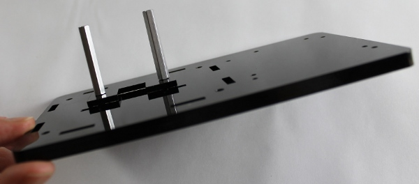

**Step 2.** 
Mount the second C-shaped **cuvette holder** onto the standoffs with the two shorter cuvette screws, with the same orientation as the previous cuvette holder.

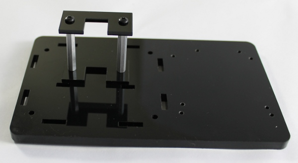

**Step 3.** 
Keeping the same orientation of the **base plate**, place one enclosure standoff on each corner and secure in place with an enclosure screw.

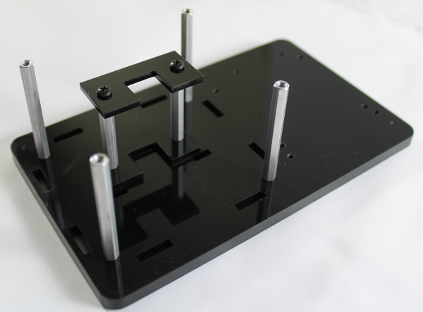

**Step 4.** 
Flip over the **base plate**, and place a rubber bumper on each corner.

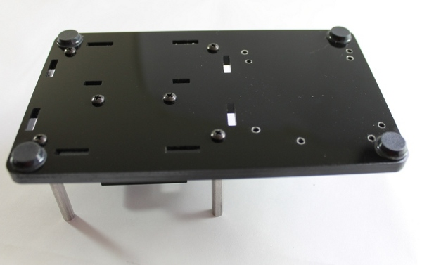

**Step 5.** 
To begin assembly of the colorimeter electronics, you will use the hardware in Bag B. Mount the Colorimeter LED Board onto the **LED mount**. Make sure that the placement of the board is close to the bottom edge of the LED mount as shown in the image below. Secure in place with four PCB screws and four PCB nuts.

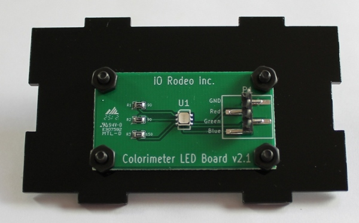

**Step 6.** 
Mount the Colorimeter Sensor Board onto the **sensor mount** passing the plastic 10-pin connector through the rectangular cutout (left and center images). Before securing in place ensure the correct orientation of the PCB as shown in the lower right image.  Secure in place with the last four PCB screws and nuts.

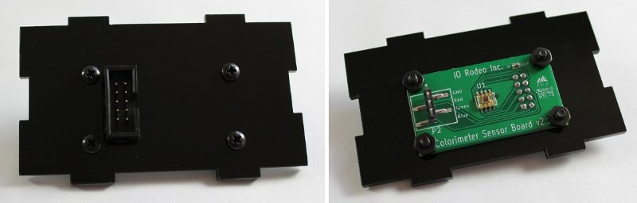

**Step 7.** 
From Bag B, take one of the black, plastic 4-pin connectors and the black pre-crimped wire. Locate the triangle marker on the housing which denotes Pin 1. Carefully push the black wire into the Pin 1 slot of the connector until it clicks into place. Next, insert the red wire into the Pin 2 slot of the connector, followed by the green wire (Pin 3 slot), and finally the blue wire (Pin 4 slot). **Make sure all wires are held firmly in place by gently pulling on them.  Do not put the connector on the other end of the wires at this point.**

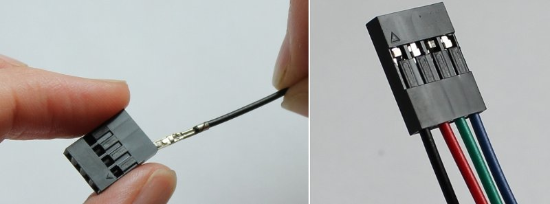

**Step 8.** 
Connect the assembled wires to the LED board (image below) so that the black wire is connected to the pin on the PCB labelled GND, the red wire to the pin labelled Red, the green wire to the pin labelled Green, and the blue wire to the pin labelled Blue. Thread the free ends of the four colored wires through the round hole in the **divider wall**. 

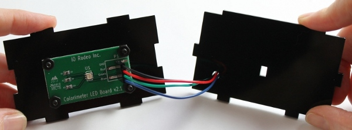

**Step 9.** 
Take the second 4-pin connector and, as before, insert the pre-crimped wires.  Remember to first locate the triangular marker on the connector, and then insert the black wire into the slot corresponding to Pin 1, followed by the red (Pin 2 slot), green (Pin 3 slot) and blue (Pin 4 slot) wires. Finally, after ensuring that the cables are properly attached, connect this to the Colorimeter Sensor Board using the same pin-orientation as before (black wire to GND pin, red wire to Red pin, etc).

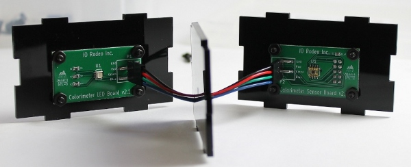

**Step 10.** 
Place the parts assembled in the previous step on the **base plate** taking note of the orientation. The sensor PCB and the **divider wall** should be on the side of the cuvette holder with the U-shaped cutout (left image). The cables may need to be adjusted to fit into the enclosure.  

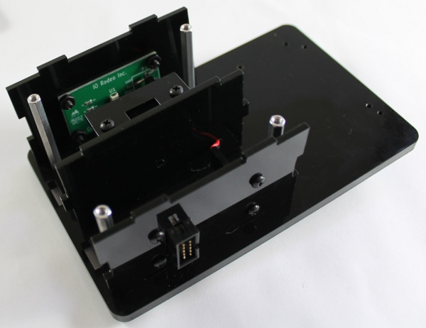

**Step 11.**
Take the two **side walls** and insert them on the **base plate** so that all the corresponding tabs and slots match.

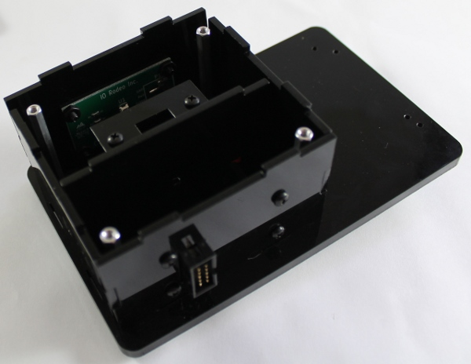

**Step 12.** 
Place the **top plate** on the enclosure ensuring that the tabs fit in the slots as shown in the Image below.

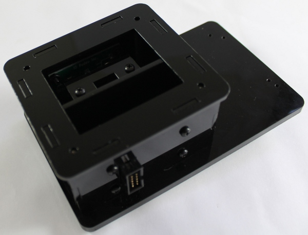

**Step 13.** 
Lay the **outer slider** and **inner slider** onto the top plate. Orient the parts as shown in the images below. 

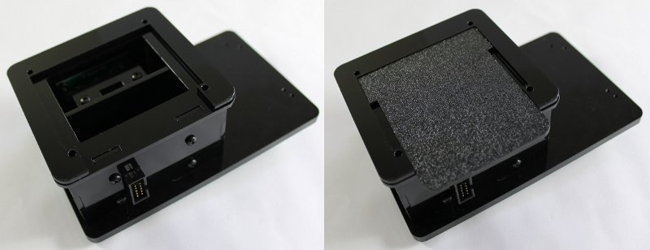

**Step 14.** 
Place the **clear cover** on the enclosure. Secure all the parts in place with the last four enclosure screws from Bag A. 

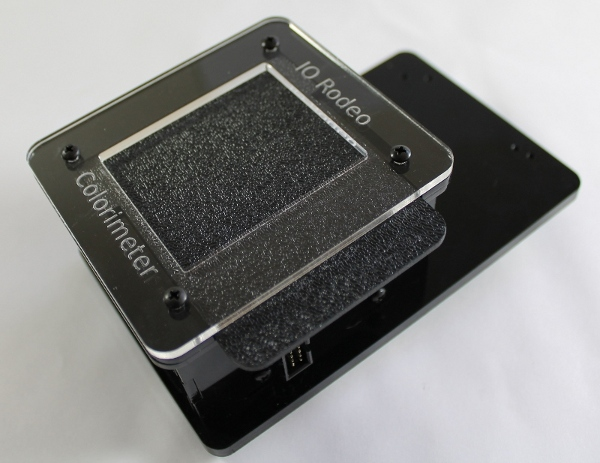

