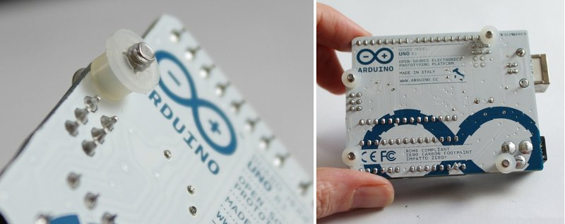
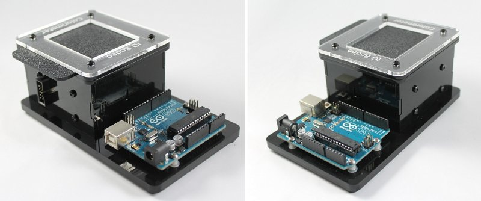
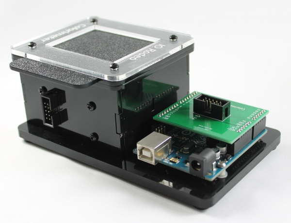
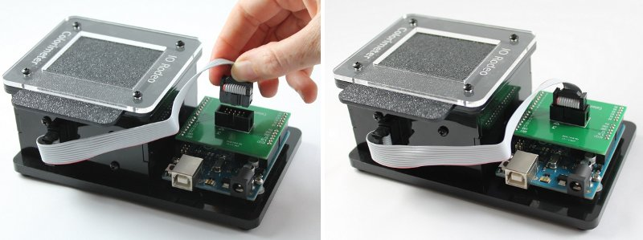
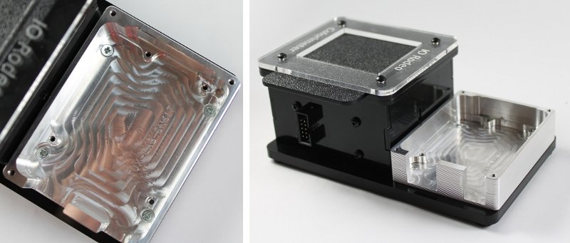
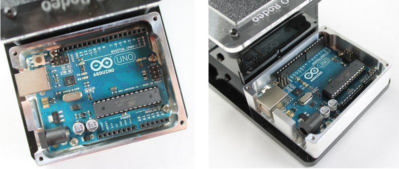
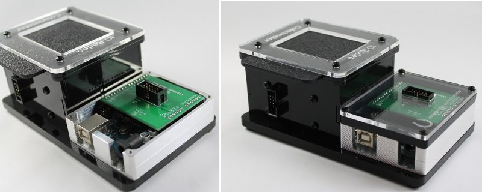
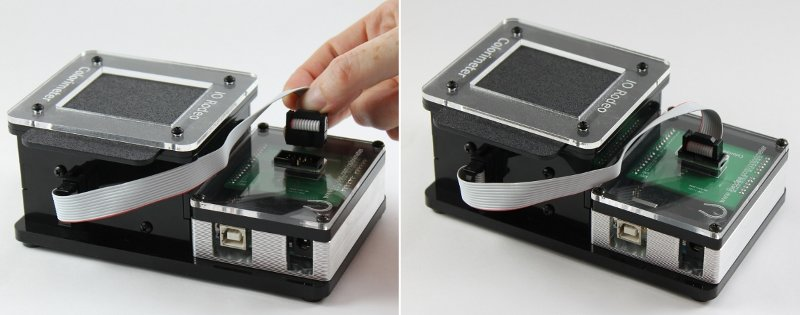

Mounting the Arduino
========================================

Option 1: Assembly of Arduino onto the acrylic base
-------------------------------------------------------

**Step 1.** To mount the Arduino Uno, take the bag of screws and plastic standoffs from Bag C. You do not need the 4 flat-head screws. Place one of the screws through one of the Arduino mount holes. On the other side place a plastic standoff and washer. The washer will hold the standoff in place while you work. Repeat for the remaining 3 mount-holes.

**Step 2.** Place the Arduino onto the base plate and line up the screws from the above step with the holes in the Arduino holes in the base plate. Screw them down into the base plate. Note: the screws will go partly into the base plate, not all the way through.

**Step 3.** Mount the colorimeter shield onto the Arduino board.  There is only one orientation possible. Note that the shield pins are labelled on the silkscreen (white text) to match the label on the corresponding header on the Arduino board.

**Step 4.** Connect the ribbon cable to both the enclosure and the colorimeter shield.  We have found it easier to connect the cable to the colorimeter first and then to the Arduino second.

Option 2: Assembly of Arduino with TuxCase
--------------------------------------------

**Step 1.** To first mount the TuxCase onto the base plate, you will need the 4 flat-head screws from Bag C. Place the TuxCase on the base plate and line-up the four corner holes with the holes on the base plate. Fasten in place with the 4 flat-head screws.

**Step 2.** Place the Arduino inside the TuxCase as shown in the Images below and fasten into the case using the 4 shorter (1/4”) screws that come with the TuxCase kit.

**Step 3.** Mount the colorimeter shield onto the Arduino board.  There is only one orientation possible. Note that the shield pins are labelled on the silkscreen (white text) to match the label on the corresponding header on the Arduino board. Place the black acrylic spacer and the clear top onto the enclosure. Using the remaining 4 screws from the TuxCase kit, secure the top in place at the four corners.

**Step 4.** Connect the ribbon cable to both the enclosure and the colorimeter shield.  We have found it easier to connect the cable to the colorimeter first and then to the Arduino second.

