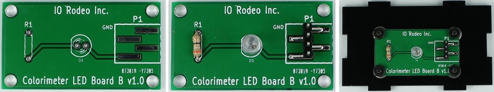
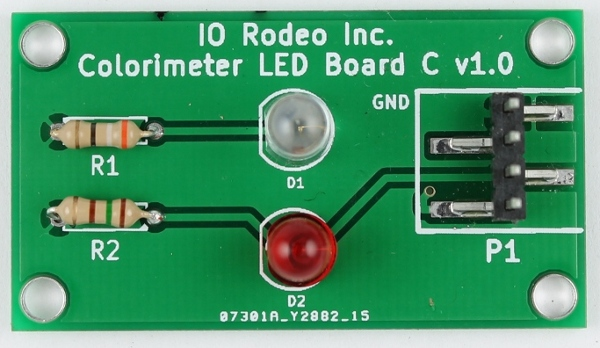
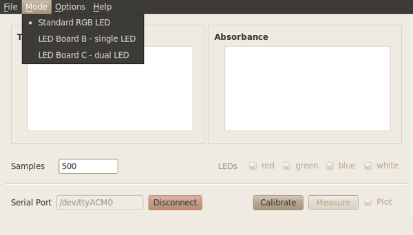

.. _custom_led_label:

Optional LED wavelengths
=============================

In addition to the RGB board that is included with the kit, there are also two additional custom boards that can be used to change the measurement wavelength. These boards can be easily swapped into the colorimeter to replace the RGB board. For example, if you only want one measurement at a wavelength other than the standard ones available, you can use LED Ver B, or for two new wavelengths, use LED Ver C.

The PCB comes with a pre-mounted 4-pin connector plus an additional laser-cut acrylic mounting plate with hardware. All you need to supply is your choice of LED and resistor. You should select a current limiting resistor for operating your LED from a 5V supply. Sparkfun has a nice tutorial on how to do this given the specs for your LED https://www.sparkfun.com/tutorials/219. 

LED Board ver B
-----------------

* This PCB can be used to mount **one** through-hole LED of your choice. 
* Pin spacing for the LED is 0.1" and the hole diameter for the pins is 0.032". 
* Pin spacing for the current limiting resistor is 0.3" and the hole diameter is 0.032".
* When used with the colorimeter the LED is connected to the Arduino DIO pin that is normally associated with the blue channel of the colorimeter.  

LED Board ver C
-----------------

* This PCB can be used to mount **two** through-hole LEDs of your choice. 
* Pin spacing for the two LEDs is 0.1" and the hole diameter for the pins is 0.032". 
* Pin spacing for the current limiting resistors is 0.3" and the hole diameter is 0.032". 
* When used with the colorimeter the LEDs are connected to the Arduino DIO pins that are normally associated with the blue (D1) and green (D2) channels of the colorimeter.  

Using custom led boards with colorimeter software
--------------------------------------------------

Before taking measurements, select "LED Board Ver C" in the LED drop-down menu of any of the colorimeter programs (basic, plotting and measure). 

