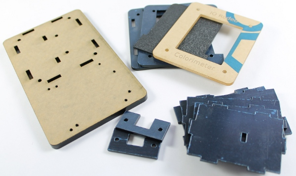
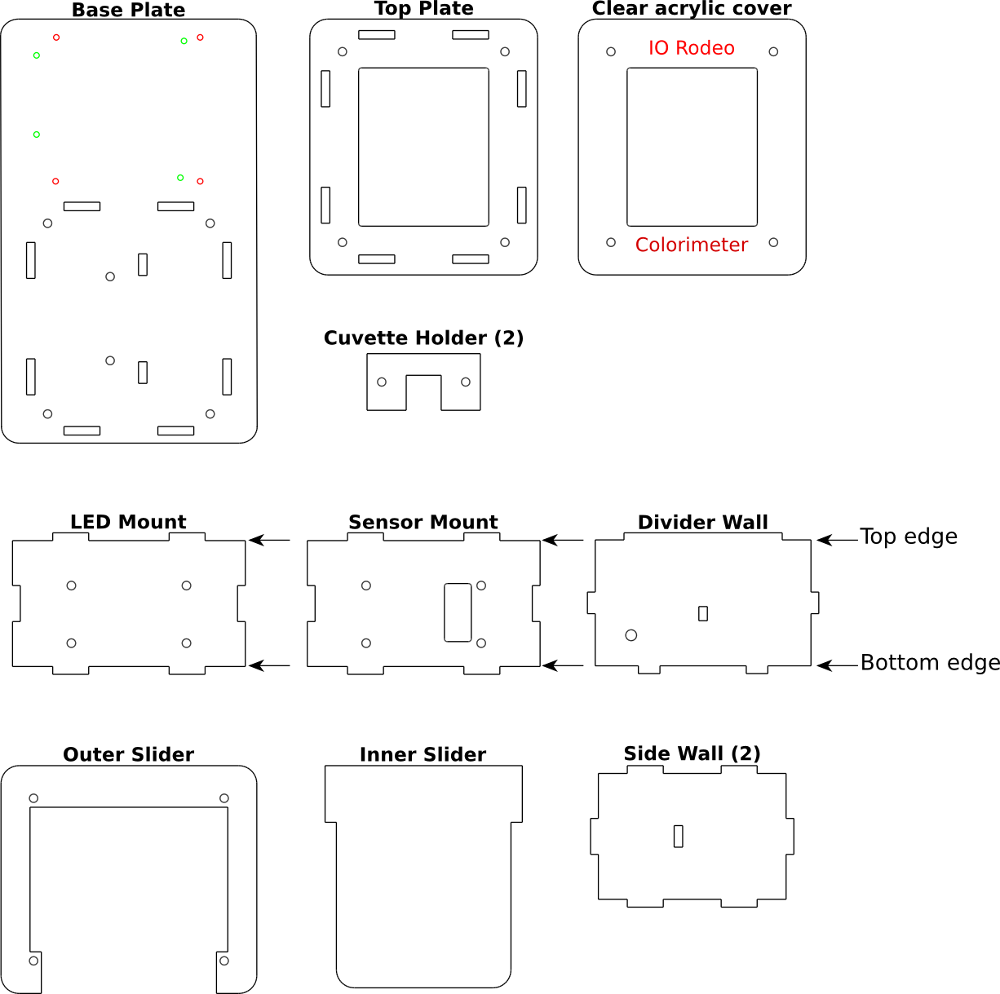

Enclosure Parts (laser-cut acrylic)
=========================================

Below is a guide for the 12 acrylic parts that make the colorimeter enclosure. Note that for the base plate, colored holes indicate the two different mounting patterns. Green = Arduino mounting holes; 
Red = TuxCase mounting holes.
 

