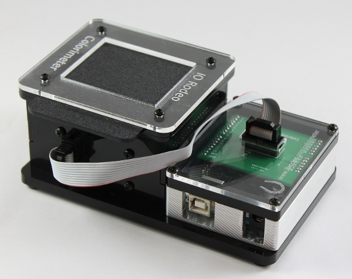

.. colorimeter documentation master file, created by
   sphinx-quickstart on Tue Dec 24 12:20:46 2013.
   You can adapt this file completely to your liking, but it should at least
   contain the root `toctree` directive.

Open source DIY kit
================================================

Kit contents
------------
.. toctree::
   :maxdepth: 2

   intro.rst
   kit_contents.rst
   electronics.rst
   hardware.rst
   enclosure.rst
   tuxcase.rst
   custom_led.rst

Assembly instructions
-----------------------
.. toctree::
   :maxdepth: 2

   assembly_step1.rst
   assembly_step2.rst
   firmware.rst

Software
---------------
.. toctree::
   :maxdepth: 2

   software_1.rst
   software_2.rst
   software_3.rst
   software_4.rst
   additional_features.rst

Sample Labs
---------------
.. toctree::
   :maxdepth: 2

   lab_1.rst
   lab_2.rst
   lab_3.rst
   

Indices and tables
==================

* :ref:`genindex`
* :ref:`modindex`
* :ref:`search`

