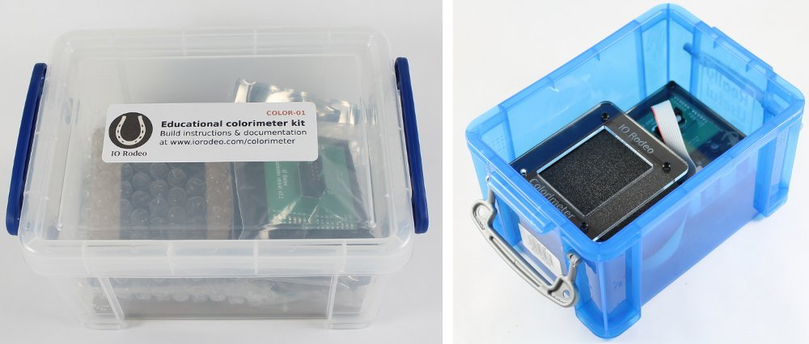

Kit Contents
====================

Each Educational Colorimeter Kit contains the electronics boards, hardware and parts listed below. The kit parts are described in more detail on the next several pages. All of the kit parts are shipped in a 1.6 L storage container (clear or blue options). After assembly, the colorimeter fits back into the container for safe storage between uses. Note that the Arduino Uno is not listed as a kit component but is required. The Arduino Uno can be purchased pre-programmed with the kit.

Parts List
--------------

Colorimeter LED board, sensor board and shield for the Arduino
^^^^^^^^^^^^^^^^^^^^^^^^^^^^^^^^^^^^^^^^^^^^^^^^^^^^^^^^^^^^^^^^^

Set of 6 cuvettes with caps (3 macro and 3 semi-macro)
^^^^^^^^^^^^^^^^^^^^^^^^^^^^^^^^^^^^^^^^^^^^^^^^^^^^^^^^^

11 black laser cut acrylic parts and a clear laser cut engraved acrylic cover
^^^^^^^^^^^^^^^^^^^^^^^^^^^^^^^^^^^^^^^^^^^^^^^^^^^^^^^^^^^^^^^^^^^^^^^^^^^^^^
.. figure:: image_07.JPG
   :align:  center

3 bags of Hardware, ribbon cable for connecting Arduino to the colorimeter and a Philips mini screwdriver
^^^^^^^^^^^^^^^^^^^^^^^^^^^^^^^^^^^^^^^^^^^^^^^^^^^^^^^^^^^^^^^^^^^^^^^^^^^^^^^^^^^^^^^^^^^^^^^^^^^^^^^^^^

.. figure:: image_08.JPG
   :align:  center

