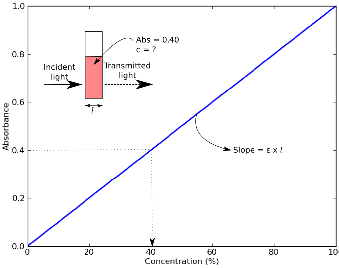
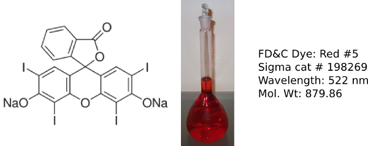
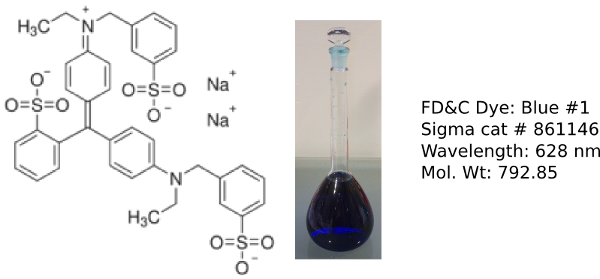
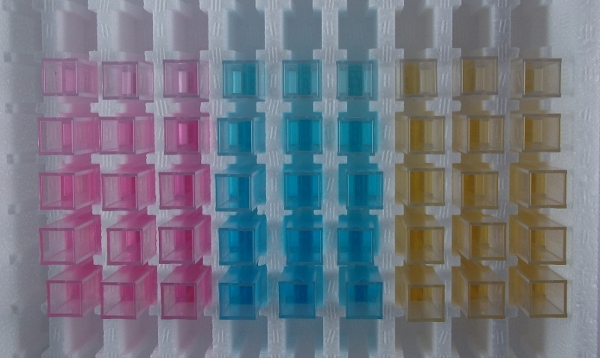
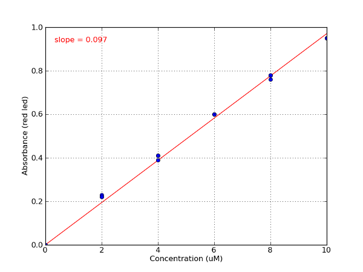

.. _lab2_label:

Lab 2: Beer's Law and Molar Extinction Coefficients
=====================================================

Background and Objectives
----------------------------
Colorimeters (and spectrophotometers) measure absorbance of light of a specific wavelength by a solution. Absorbance values can be used to determine the concentration of a chemical or biological molecule in a solution using the Beer-Lambert Law (also known as Beer’s Law).  Beer’s Law states that absorbance of a sample (*Abs*) depends on the molar concentration (*c*), light path length in centimeters (*l*), and molar extinction coefficient (*ε*) for the dissolved substance at the specified wavelength (*λ*) [#f1]_. 

.. math::  

   \mathrm{Absorbance} = \varepsilon \times c \times l

An example of a Beer’s Law plot (concentration versus absorbance) is shown below. The slope of the graph (absorbance over concentration) equals the molar absorptivity coefficient, *ε* x *l*. The objective of this lab is to calculate the molar extinction coefficients of three different dyes from their Beer’s Law plot.

Food dyes are used to color a variety of food products such as sweets, cereal and sports drinks and are often used in high school and undergraduate labs [#f2]_. The 3 dyes used in this lab were chosen as they absorb in the range of the colorimeter LED wavelengths.

**Erythrosin B**

**Erioglaucine**

**Sunset Yellow**

Materials
--------------

The following list of materials is required for this lab. 

* Assembled Educational Colorimeter kit from Lab 1
* Powdered food dyes erythrosin B, erioglaucine and sunset yellow
* Analytical scale
* 3 x 250 mL volumetric flasks
* 15 x test tubes (>5 mL)
* 1 mL fixed volume pipette
* 16 x cuvettes
* Water

Methods
----------
This lab uses the Educational Colorimeter Plotting program. 

Step 1: Prepare 1 mM stock of dyes
^^^^^^^^^^^^^^^^^^^^^^^^^^^^^^^^^^^^^^^

* Erythrosin B (FW: 879.86):     e.g. 0.218 g in 250 mL distilled water
* Erioglaucine (FW: 792.85):     e.g. 0.198 g in 250 mL distilled water
* Sunset Yellow (FW:452.37):     e.g. 0.113 g in 250 mL distilled water

Step 2: Preparation of working stocks
^^^^^^^^^^^^^^^^^^^^^^^^^^^^^^^^^^^^^^^^^

Dilute the 1 mM stock solutions as shown in the Table below using a 250 mL volumetric flask.  Label these flasks **working stock**;

=============       ======================      =============================== 
Dye                 Volume of 1 mM stock        Concentration of working stock  
=============       ======================      =============================== 
Erythrosin B        1 mL in 250 mL              4.00 µM                             
Erioglaucine        2.5 mL in 250 mL            10.00 µM                            
Sunset Yellow       10 mL in 250 mL             40.00 µM                            
=============       ======================      =============================== 

Step 3: Preparation of standard curve
^^^^^^^^^^^^^^^^^^^^^^^^^^^^^^^^^^^^^^^^^

For each of the 3 dyes, prepare a series of standard curve dilutions as shown in the Table below using the test tubes. Label tubes #1-5 for each dye;

=======    ========================     =============  =============  ==============
Tube #     Volume of working stock      Erythrosin B   Erioglaucine   Sunset Yellow
=======    ========================     =============  =============  ==============
1          1 mL + 4 mL H2O              0.8 µM         2 µM           8 µM
2          2 mL + 3 mL H2O              1.6 µM         4 µM           16 µM
3          3 mL + 2 mL H2O              2.4 µM         6 µM           24 µM
4          4 mL + 1 mL H2O              3.2 µM         8 µM           32 µM
5          5 mL + 0 mL H2O              4.0 µM         10 µM          40 µM
=======    ========================     =============  =============  ==============

Step 4: Measure absorbance with the colorimeter and plot data
^^^^^^^^^^^^^^^^^^^^^^^^^^^^^^^^^^^^^^^^^^^^^^^^^^^^^^^^^^^^^^^^^^

* Launch the colorimeter plotting program. Calibrate the device with a cuvette containing water.
* Starting with erythrosin B, measure the absorbance for each standard curve solution with the appropriate color channel [#f3]_, and enter the corresponding erythrosin B concentration in the program plotting table;
* Once all the samples are measured, click on the “Plot” button. Record values for the slope in Table 3.
* Repeat measurements for erioglaucine and sunset yellow. 

==============    =========================    ===========================  =============================  =====================
Dye               Color channel/wavelength     Plotted Slope (µM vs. Abs)   Molar extinction coefficient   Reported value 
==============    =========================    ===========================  =============================  =====================
Erythrosin B      Green/528 nm                 0.056                        56,000 M-1 cm-1 at 528 nm      82,500 (524-528 nm)
Erioglaucine      Red/625 nm                   0.098                        98,000 M-1 cm-1 at 625 nm      80,000 (627-637 nm)
Sunset Yellow     Blue/470 nm                  0.020                        20,000 M-1 cm-1 at 470 nm      20,000 (479-485 nm)
==============    =========================    ===========================  =============================  =====================

Sample Data
-------------

**Image of cuvettes with 3 different food dye standard curves**

**Sample data - Erioglaucine standard curve**

.. rubric:: Footnotes

.. [#f1] **Path length** (distance that light travels through the solution) is determined by the cuvette that the sample is placed in. Most colorimeters and spectrophotometers, including the one in this kit, use cuvettes with a path length of 1 cm. **Molar extinction coefficient** is a measure of how strongly a substance absorbs light at a particular wavelength, and is usually represented by the unit M-1 cm-1 or L mol-1 cm-1. 

.. [#f2] For example: **Sigman and Wheeler 2004**, J. Chemical Education 81 (10): 1475-1478; **Henary and Russell, 2007**, J. Chemical Education 84 (3) 480-482. 

.. [#f3] To verify which color channel to use for each dye you can measure absorbance at all 3 wavelengths as described in Lab 1. 

