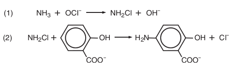

.. _lab3_label:

Lab 3: Ammonia and nitrate measurements
=========================================

Background and Objectives
-----------------------------

Nitrification bacteria play an important role in the nitrogen cycle, oxidizing ammonia first to  nitrite and finally to nitrate. Nitrification in nature is the result of actions of two groups of organisms:

(1) **Nitrosomonas bacteria**  - ammonia-oxidizing bacteria convert ammonia to nitrite:

.. math::  

   NH^3 + O_2 → NO^{2−} + 3H^+ + 2e^− 

(2) **Nitrifying bacteria** - nitrite-oxidizing bacteria convert nitrite to nitrate:

.. math::  

   NO^{2−} + H_2 O → NO^3− + 2H^+ + 2e^− 

The objective of this lab is to monitor the levels of ammonia and nitrate over the course of 4 days in the presence of nitrification bacteria. Nitrification bacteria are widespread in soil and water and are found in highest numbers where considerable amounts of ammonia are present. In this lab, substrate (gravel) from an established aquarium will be used as the source of nitrification bacteria. 

Colorimetric tests
---------------------

Previously, in Labs 1 and 2, we used food dyes which are already colored. However, ammonia and nitrate are colorless in water. In this lab we will use colorimetric assays which yield a color only in the presence of ammonia or nitrate.

**Ammonia: Salicylate test**
The ammonia-salicylate method involves a three-step reaction sequence. The first reaction step involves the conversion of ammonia to monochloroamine by the addition of chlorine. The monochloroamine then reacts with salicylate to form 5-aminosalicylate.  Oxidation of 5-aminosalicylate is carried out in the presence of a catalyst, nitroferricyanide, which results in the formation of indosalicylate, a blue-colored compound. The blue color is masked by the yellow color (from excess nitroprusside) yielding a green-colored solution that absorbs light at 650 nm. The intensity of the color is directly proportional to the ammonia concentration in the sample.

*(1) Ammonia compounds are initially combined with hypochlorite to form monochloramine;* 
*(2) Monochloramine reacts with salicylate to form 5-aminosalicylate.*

**Nitrate: Enzyme based assay**
The assay for measuring nitrate is a 2-step process. First, nitrate in the sample is converted to nitrite enzymatically using nitrate reductase (NR). In the second step, nitrite is measured using Greiss test. In the Greiss test, sulfanilamide reagent is converted to a diazonium salt by nitrite. The diazonium salt is then reacted with the reagent NED (N-1-napthylethylene diamine dihydrochloride) to form a colored azo dye which has a purple/magenta color that is measured at 520-550 nm (using the green LED). 

Step 1) Nitrate reductase:    

.. math::  

   NO_3 ^-  + NADH + H^+ → NO_2 ^- + NAD + H_2 O  

Step 2) Griess reaction:

.. figure:: lab_11.gif
   :align:  center

Materials
-------------
* Labware: Beakers, volumetric flasks, graduated pipettes, test tubes, solution storage bottles, microfuge tubes
* Store bought aquarium gravel (unused)
* Gravel from an established (and healthy) aquarium.

Chemicals and solutions
------------------------

=============================  =====================   =============  ==============
Chemical                       Vendor                  Cat #          Approx. Cost
=============================  =====================   =============  ==============
Sodium hydroxide               Carolina Biologicals    889425         $5.25
Sodium salicylate              Sigma                   S2679-100G     $35.00
Sodium nitroferricyanide       Sigma                   228710-5G      $30.20
6% Sodium hypochloride [#f1]_                                          $2.00
Nitrate Reductase (2 Units)    NECi [#f2]_             800302         $39.00
NADH                           Sigma                   43420-100MG    $28.90
EDTA                           Carolina Biologicals    861780         $16.25
Potassium phosphate (KH2PO4)   Sigma                   P5655-100G     $21.50
Potassium hydroxide            Carolina Biologicals    883485         $5.25
Sulfanilamide                  Sigma                   S9251-100G     $33.70
3M Hydrochloric acid           Carolina Biologicals    867861         $6.75
NED [#f3]_                     Sigma                   33461-5G       $38.50
1,000 ppm ammonia              Scientific Strategies   615-4RC        $17.82
10 ppm ammonia                 Scientific Strategies   5450-4RC       $16.55
10 ppm Nitrate standard        Scientific Strategies   5456-4RC       $16.55
Distilled water                                                       $2.00
=============================  =====================   =============  ==============

Methods
--------
This lab requires the use of both the Educational Colorimeter Plotting and Concentration programs. Using the “Export” functionality of the former, standard curves are generated for use in the latter. Before starting the lab, download the software and review the operation of these programs.

Day 1) Setting up the experiment and initial sample collection
^^^^^^^^^^^^^^^^^^^^^^^^^^^^^^^^^^^^^^^^^^^^^^^^^^^^^^^^^^^^^^^^^

* Transfer 1 mL of a 1,000 ppm ammonia stock to a 500 mL volumetric flask. Bring up to the mark using distilled water. This is your 2 ppm ammonia stock;
* Divide the 2 ppm solution into two beakers and label one as “Gravel” and another as “Gravel + Bacteria”.
* Take a scoop (25–50 g) of aquarium gravel from the store bought bag. Place in the beaker labelled “Gravel”.
* To obtain nitrification bacteria, remove an equivalent amount of gravel from an established aquarium as your source of nitrification bacteria. Place in the beaker labelled “Gravel + Bacteria”.

.. figure:: lab_12.JPG
   :align:  center

* Transfer 1.5 mL of sample to a clean microfuge tube for ammonia measurements. 
* Transfer 1.0 mL of sample to a clean microfuge tube for nitrate measurements. 
* Label these two samples as “T=0”. Store them at –20°C.
* Repeat sampling every 24 hours for the following 4 days of the experiment, and label them “T=1”, …, “T=4”, respectively.  You will collect a total of 10 samples (5 for ammonia, and 5 for nitrate measurements).

Day 2) Prepare solutions
^^^^^^^^^^^^^^^^^^^^^^^^^^^^^
Prepare the following solutions for making the ammonia and nitrate measurements. 

**1) Hypochlorite solution:**

* Place 1 ml of bleach into a 100 mL volumetric flask and fill with 70 mL of DI water;
* Add 0.5 grams of NaOH and mix until dissolved;
* Fill flask to the 100 mL mark.

**2) Salicylate/Catalyst solution:**

* Place 10 g of sodium salicylate into a 100 mL volumetric flask and fill with 70 mL of DI water until dissolved.
* Add 0.04 grams of sodium nitroferricyanide and mix until dissolved.
* Add 0.5 grams NaOH to adjust the pH to the ~12.0 range.
* Fill flask to the 100 mL mark.  Transfer solution into a dark, airtight glass bottle for maximum longevity. Due to limited storage life, prepare fresh solutions weekly.

**3) 25 mM EDTA**

* Dissolve 9.3g EDTA in 1L of distilled water.

**4) Phosphate buffer (25 mM KH2PO4, 0.025 mM EDTA, pH 7.5)**

* Dissolve 3.75 g of potassium phosphate (KH2PO4) and 1.4 g potassium hydroxide (KOH) in 800 mL of distilled water in a 1L volumetric flask
* Add 1 mL of 25 mM EDTA and fill to the mark

**5) 2 units/mL nitrate reductase**

* Add 1 mL of NECi proprietary enzyme diluent to 2 units of freeze-dried enzyme and reconstitute following the instructions supplied with the enzyme.

**6) 1 mg/mL NADH**

* Dissolve 0.1 g of NADH (FW=709.4) in 100 mL distilled water. Aliquot and store unused NADH in the freezer.

**7) 1% sulfanilamide solution**

* Weigh out 0.15g of sulfanilamide into a small amber bottle. Add 15 mL of 3M HCl.

**8) 0.02% NED**

* Weigh out 0.02 g of NED into an amber bottle. Add 100 mL of distilled water.

Day 3) Prepare ammonia standard curve
^^^^^^^^^^^^^^^^^^^^^^^^^^^^^^^^^^^^^^^^

* Transfer 20 mL of the 10 ppm ammonia standard solution to a 100 mL volumetric flask. Fill flask to the 100 mL mark with distilled water and invert several times to mix. Label flask as 2.0 ppm ammonia.
* Label nine large test tubes #1-9. Pipette the indicated volumes of 2.0 ppm ammonia and distilled water into the test tubes as shown in the Table below.

======   ============   ==============  ==============   =========================   =========================
Tube #   N Conc (ppm)   NH3 Conc (ppm)   NH3 Conc (µM)   Volume of 2.0 ppm ammonia   Volume of distilled water
======   ============   ==============  ==============   =========================   =========================
1        0.00           0.000            0.00            0.0 mL                           8.0 mL
2        0.25           0.305            17.9            1.0 mL                           7.0 mL
3        0.50           0.610            35.8            2.0 mL                           6.0 mL
4        0.75           0.915            53.7            3.0 mL                           5.0 mL
5        1.00           1.220            71.6            4.0 mL                           4.0 mL
6        1.25           1.525            89.5            5.0 mL                           3.0 mL
7        1.50           1.830            107.4           6.0 mL                           2.0 mL
8        1.75           2.135            125.3           7.0 mL                           1.0 mL
9        2.00           2.440            143.2           8.0 mL                           0.0 mL
======   ============   ==============  ==============   =========================   =========================

* Transfer 1 mL of each sample to be tested into a new test tube.  Note: we recommend doing the measurements in triplicate.
* Add 250 µL of hypochlorite solution and mix
* Add 250 µL of salicylate/catalyst solution and mix
* Let tubes stand for 5-10 mins to develop color.
* Launch the Educational Colorimeter Plotting program, and select the Red color channel.
* Transfer the contents of Tube #1 (0.0 µM ammonia) into a cuvette, and use it for calibration.
* Before removing the calibration sample from the enclosure, click “Measure” (Absorbance value should be ~0.00).
* In the cell next to the measurement, enter the concentration value in µM (which in this case is 0.0).
* Transfer the contents back into the test tube. (It is good practice to rinse the cuvette with distilled water between samples)
* Transfer the next solution (Tube #2) into the cuvette, place it inside the enclosure, and click “Measure”.
* In the cell next to the measurement, enter the concentration value in µM.
* Repeat steps 11–13 for the remaining samples.
* After completing all measurements, and entering all concentration values, click “Plot” to graph your data.  The points should roughly follow a linear trend (see sample graphs below).
* Using the file menu, go to “File>Export”, choose a filename for storing your sample curve (eg, student1_ammonia_sc), and click “OK”.

**Image of cuvettes with ammonia standard curve in triplicate**

.. figure:: lab_13.JPG
   :align:  center

**Sample ammonia standard curve**

.. figure:: lab_14.png
   :align:  center

Day 4) Prepare nitrate standard curve
^^^^^^^^^^^^^^^^^^^^^^^^^^^^^^^^^^^^^^^

* Remove the NADH and nitrate reductase prepared in Step 2 from the freezer. Thaw the NADH. In a test tube, prepare a “10 x master mix” of enzyme, NADH and phosphate buffer as shown in the Table below.

============================   ========       ================
Reagent                        1 x mix        10 x master mix
============================   ========       ================
Phosphate buffer               890 µL         8.9 mL
1 mg/mL NADH                   100 µL         1 mL
2 Units/mL Nitrate reductase   10 µL          0.1 mL
**Total Volume**               1000 µL        10 mL
============================   ========       ================

* Label nine tubes #M1, M2, …, M9. To each tube transfer 1 mL of the master mix.
* To prepare the standard curve samples, label nine test tubes #1–9. Pipette the indicated volumes of 10 ppm nitrate standard and distilled water into these test tubes as shown in the Table below.

======   ============   ==============  ==============   =========================   =========================
Tube #   N Conc (ppm)   NO3 Conc (ppm)   NO3 Conc (µM)   Volume of 10 ppm nitrate    Volume of distilled water
======   ============   ==============  ==============   =========================   =========================
1        0.00           0.000            0.00            0.0 mL                      8.0 mL
2        1.25           5.537            89.25           1.0 mL                      7.0 mL
3        2.50           11.075           178.5           2.0 mL                      6.0 mL
4        3.75           16.613           267.75          3.0 mL                      5.0 mL
5        5.00           22.15            357             4.0 mL                      4.0 mL
6        6.25           27.688           446.25          5.0 mL                      3.0 mL
7        7.50           33.225           535.5           6.0 mL                      2.0 mL
8        8.75           38.763           624.75          7.0 mL                      1.0 mL
9        10.00          44.30            714             8.0 mL                      0.0 mL
======   ============   ==============  ==============   =========================   =========================

* Add 50 µL of each standard curve sample to the corresponding tube containing the master mix (eg, from tube #1 to tube #M1, etc.). Mix thoroughly and incubate for 20–30 minutes.
* Add 500 µL of 1% sulfanimide to each tube and mix
* Add 500 µL of 0.02% NED to each tube and mix. 
* Launch the Educational Colorimeter Plotting program, and select the Green color channel.
* Transfer the contents of Tube #M1 (0 ppm nitrate) into a cuvette, and use it for calibration.
* Before removing the calibration sample from the enclosure, click “Measure” (Absorbance value should be ~0.00).
* In the cell next to the measurement, enter the concentration value in µM (which in this case is 0.0).
* Transfer the contents back into the test tube. (It is good practice to rinse the cuvette with distilled water between samples)
* Transfer the next solution (Tube #M2) into the cuvette, place it inside the enclosure, and click “Measure”.
* In the cell next to the measurement, enter the concentration value in µM.
* Repeat steps 11–13 for the remaining samples.
* After completing all measurements, and entering all concentration values, click “Plot” to graph your data.  
* Using the options menu, go to “Options>Export”, choose a filename for storing your sample curve (eg, student1_nitrate_sc), and click “OK”.

**Image of cuvettes with nitrate standard curve in duplicate**

.. figure:: lab_15.JPG
   :align:  center

**Sample nitrate standard curve**

.. figure:: lab_16.png
   :align:  center

Day 5) Measure nitrate and ammonia in samples
^^^^^^^^^^^^^^^^^^^^^^^^^^^^^^^^^^^^^^^^^^^^^^^^
Take your last sample from the experiment (“T=4”).  Remove from the freezer the samples collected on previous days (“T=0”, …, “T=3”) and thaw.

* Process all 10 samples (5 for nitrate, and 5 for ammonia measurements) the same way as you did for generating the standard curves on Days 3 and 4. Don’t forget to also process a distilled water sample for calibration. 
* Once you have the samples ready for measurement, open the Educational Colorimeter Concentration program.
* Starting with ammonia, select the standard curve generated on Day 3 from the drop down list (eg, “student1_ammonia_sc”). Note that the Red color channel will be automatically selected.
* Calibrate the colorimeter with the 0 µM ammonia control, and measure all of your ammonia samples. Label the corresponding measurements as “Day 0”, …, “Day 4”.
* Once you have finished click the “Plot” button. Save the displayed graph.
* Repeat steps above for nitrate. Select the standard curve generated on Day 4 from the drop down list (eg, “student1_nitrate_sc”). Note the Green color channel will be automatically selected.

Sample Data
-------------

**Ammonia concentration over time**

**Nitrate concentration over time**

.. figure:: lab_18.png
   :align:  center

**Ammonia concentration over time - Control sample (no bacteria)**

.. figure:: lab_19.png
   :align:  center

**Nitrate concentration over time - Control sample (no bacteria)**

.. figure:: lab_20.png
   :align:  center

.. rubric:: Footnotes

.. [#f1] Common household bleach available from most grocery and hardware stores
.. [#f2] Nitrate Elimination Company, Inc
.. [#f3] NED: N-1-napthylethylene diamine dihydrochloride.

