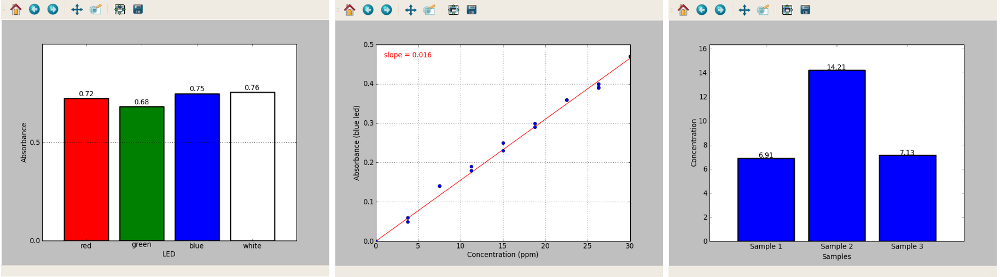

Open source colorimeter software 
=================================================================

The open source software is licensed under the Apache Licence. Source files are available at `http://bitbucket.org/iorodeo/colorimeter <http://bitbucket.org/iorodeo/colorimeter>`_. The colorimeter software can be used on Linux, Windows and Mac OS. 

The software suite is divided into 3 standalone programs:

* **Basic program** - Measures absorbance at multiple wavelengths and plots data as a bar graph

* **Plotting program** - Measures absorbance at one wavelegth and plots graph of absorbance versus concentration
* **Concentration program** - Measures concentration (ppm or uM) 

Installing the open source software
-----------------------------------------

Download the software for your choice of Operating System (Windows, Mac or Linux) from `www.iorodeo.com/software/colorimeter <www.iorodeo.com/software/colorimeter>`_.  For Windows and Mac OS the files are provided as precompiled binaries so that they can be launched immediately after download. For Linux, installation instructions can be found in the source package.  

Mac Users
^^^^^^^^^^^^^
* Requires Mac OS version 10.8 or higher. 
* There is a known issue with the software on MacBook Pros with Core 2 Duo processors - we are currently working to resolve this.
* Instructions for installing from source can be found here.

Windows Users 
^^^^^^^^^^^^^^^^^^^^^
* May require installation of Arduino drivers. See -- add link here.
 
