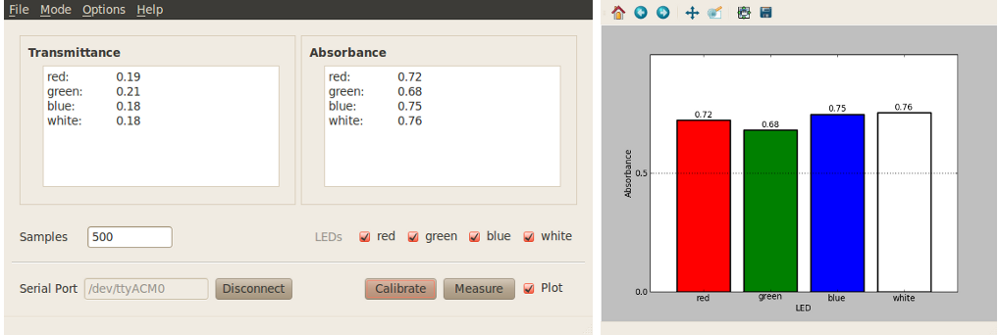
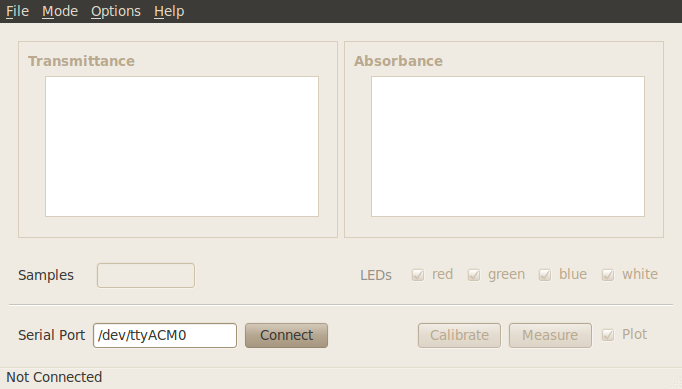
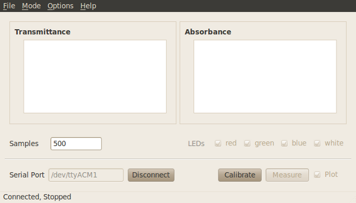
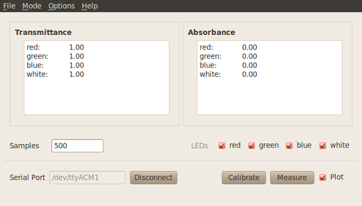
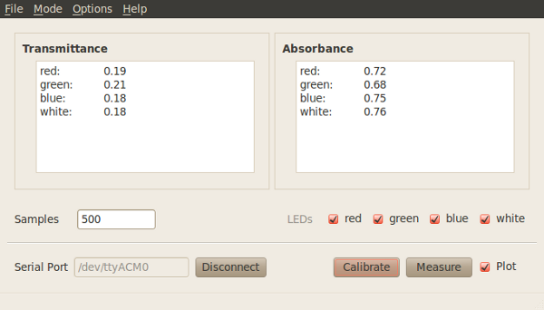
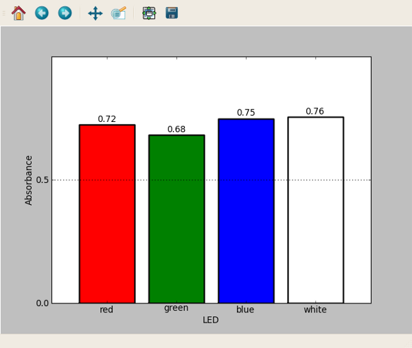

Colorimeter basic program
===========================

This program reports the Transmittance and Absorbance measured by the colorimeter for the wavelength(s) of light selected by the user. For an example of a lab using this program see :ref:`lab1_label`.

Procedure: Connect-Calibrate-Measure
---------------------------------------
Refer to the screenshots below for clarification of steps.
 
* With the basic program window open enter the serial port corresponding to your device in the program window and click on the “Connect” button in the lower left-hand side. 
* Calibrate sensor. Place a cuvette with your 'blank' measurement (e.g. water) inside the colorimeter and click "Calibrate". The data tables will display a value of 1.00 for Transmittance and 0.00 for Absorbance on all color channels. See :ref:`calibrate_label` for more information.
* Place a cuvette containing your sample inside the colorimeter and click “Measure”. The Transmittance and Absorbance tables will display the measurements corresponding to the selected color channels.  In addition, a second window will automatically open, displaying a bar graph of the measurements. 

Additional software features
^^^^^^^^^^^^^^^^^^^^^^^^^^^^^^^^
See :ref:`custom_options_label` for more information on these features.

* Custom wavelengths.  
* Save data at any point after calibration using the “File -> Save” menu item at the top of the program window.
* Plot on/off. Use checkbox to display or hide plotted data.
* LED on/off. Use checkbox next to each led to deselect one or more of the leds at any time after calibration. The program will display values only for the selected color channels.
* Change sample rate. 

Additional software screenshots
-----------------------------------

Start screen
^^^^^^^^^^^^^^^

Start screen after connecting to the serial port
^^^^^^^^^^^^^^^^^^^^^^^^^^^^^^^^^^^^^^^^^^^^^^^^^^

Calibration
^^^^^^^^^^^^^^^

Measurement data
^^^^^^^^^^^^^^^^^

Bar graph of data
^^^^^^^^^^^^^^^^^^

