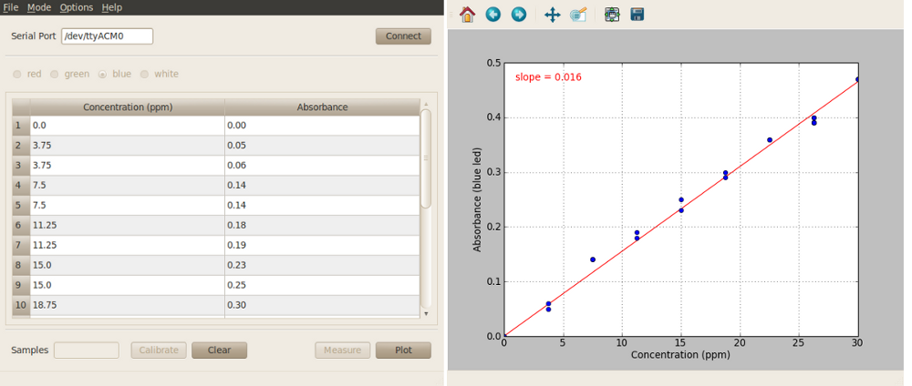

Colorimeter plotting program
==============================

This program allows users to generate calibration curves that are typically used to find the concentration of a solution. For an example of a lab using this program see :ref:`lab2_label`.

Procedure: Connect-Calibrate-Measure-Plot-Export
--------------------------------------------------------
 
* With the plotting program window open enter the serial port corresponding to your device in the program window and click on the “Connect” button in the lower left-hand side. 
* Select which LED to use from the options in the upper bar. Unlike the basic program, you can only use one LED for the plotting measurements.
* Calibrate sensor. Place a cuvette with your 'blank' measurement (e.g. water) inside the colorimeter and click "Calibrate". After calibration, click on "Measure" with your 'blank' cuvette still in place. The colorimeter should return a zero absorbance value.
* Place a cuvette containing your first sample into the colorimeter and click “Measure”. The absorbance value will be displayed in the table. You can either enter the corresponding concentration value at this time or skip ahead to the next measurement.
* At any point after calibration you can plot the data in the table by clicking “Plot”.  A second window will automatically open, and display a scatter plot of the data. 
* Once you finished measuring and plotting you can export the data for later use with the concentration program using the “Options-> Export Test Solution” menu item at the top of the program window. After exporting, this file will be automatically available for use with the concentration program.

Additional software features
^^^^^^^^^^^^^^^^^^^^^^^^^^^^^^^^
See :ref:`custom_options_label` for more information on these features.

* Custom wavelengths. 
* Save data at any point after calibration using the “File -> Save” menu item at the top of the program window.
* Change sample rate. 

Additional software screenshots
-----------------------------------

Start screen
^^^^^^^^^^^^^^^^

Start screen after connecting to the serial port
^^^^^^^^^^^^^^^^^^^^^^^^^^^^^^^^^^^^^^^^^^^^^^^^^^

Measurement data
^^^^^^^^^^^^^^^^^^

.. figure:: screenshot_8_small.png
   :align:  center

Plot of data
^^^^^^^^^^^^^

.. figure:: screenshot_9.png
   :align:  center

Fitting data
^^^^^^^^^^^^^^^^

.. figure:: screenshot_12.png
   :align:  center

Exporting data
^^^^^^^^^^^^^^^^^

.. figure:: screenshot_13.png
   :align:  center

